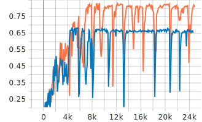

# Adaptive-CNN-based-on-Wigner-Ville-distribution

Official implementation of:
"An Adaptive Convolution Based on Instantaneous Correlation and Its Application in Multi-Condition Fault Diagnosis of Gearbox"

## Environment
Python >= 3.9  
PyTorch >= 2.0.1

## Dataset
You could download the original datasets from:  
+ MCC5-THU gearbox dataset: [[Mendeley Data]](https://data.mendeley.com/datasets/p92gj2732w/2) [[IEEE Dataport]](https://ieee-dataport.org/documents/multi-mode-fault-diagnosis-datasets-gearbox-under-variable-working-conditions)  
+ WT planetary gearbox dataset: [[Github]](https://github.com/Liudd-BJUT/WT-planetary-gearbox-dataset)

The sample segmentation follows the method described in the paper. To facilitate understanding and reproduction of the code, we have provided the processed MCC5-THU dataset in the data folder. However, the processed WT dataset is quite large, and due to GitHub's file upload size limits, it is not provided here directly. You could download it from:  
+ Processed WT gearbox dataset: [[Baidu Netdisk]](https://pan.baidu.com/s/1CXUX9ntJeO-zUBwqVEfbUw) (Extraction code: o09y)

## Usage
The hyperparameters are set by default for the MCC5-THU dataset and can be switched via the command line as needed.<br>
Run proposed model (on MCC5-THU):<br>
```
python main.py --ADCNN_improve --weight 0.8 --data_path "your\data\path"
```
Run CNN model (on MCC5-THU):<br>
```
python main.py --weight 0 --data_path "your\data\path"
```
The code uses tensorboard to record training and validation history.  
The figure below shows a probable example of the validation accuracy curves during training on the MCC5-THU dataset.  
* Brown- Proposed (ADCNN+MTL)  
* Blue- CNN  
<br>
## License
MIT License
